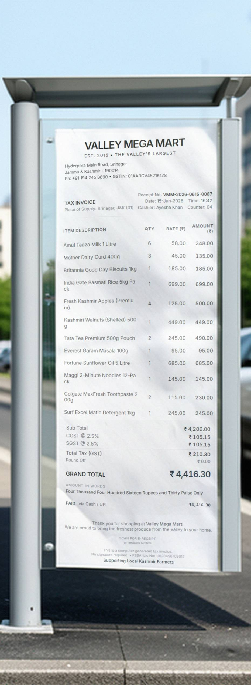
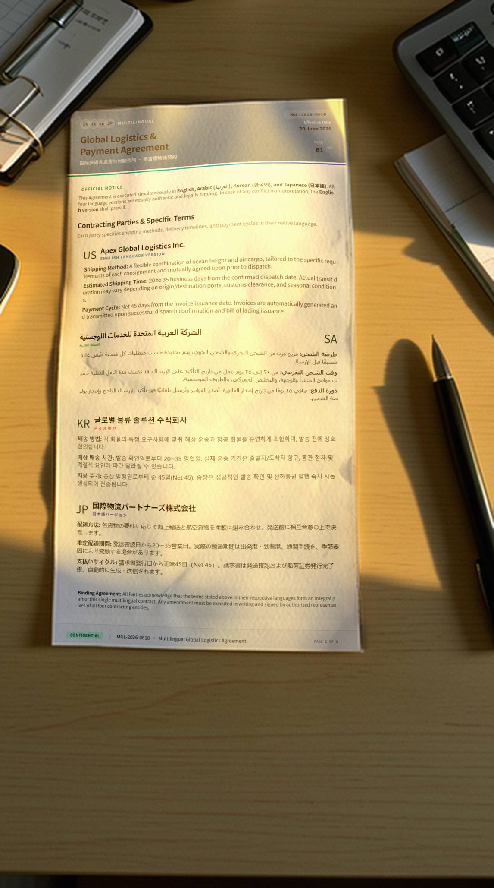
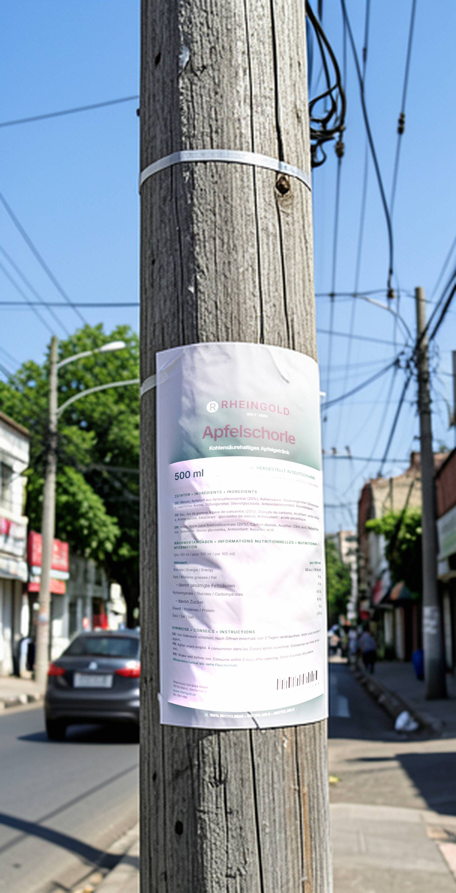
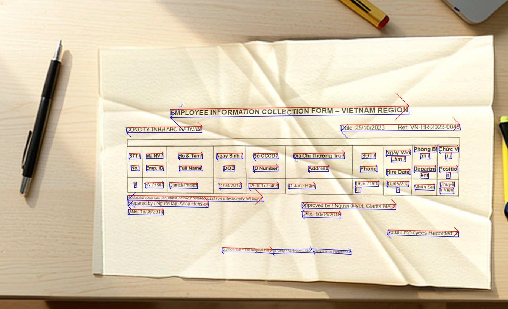

# Synthetic Engine
Generate documents and invoices for VLM/OCR model training quickly.

## Don't spend too much time reading the text, just look at the showcases.

**Business-Oriented Synthetic OCR Dataset Generator**

Generate photorealistic business documents with annotations — ready for use in OCR and VLM training.

<h2 style="color: red;">
    <strong>
    * This project is not a demo — it is a complete, logically self-consistent, highly mature, and fully reproducible methodology.
    </strong>
</h2>

### Updates
- **2026/05/28** — Added an Arabian example.
- **2026/05/30** — Added a [Question and Answer (Q&A) module](./questions/README.md) to this project.

### Why It Matters
In FinTech, Logistics, and Healthcare, real business documents are often scarce, highly sensitive, or expensive to label. Synthetic Engine solves this by producing high-fidelity synthetic images that closely match real-world conditions while automatically providing accurate, structured annotations.

The result: enterprises can rapidly build robust document AI systems without compromising data privacy or waiting months for labeled data.

### What It Builts
- **Photorealistic business images** — invoices, receipts, contracts, forms, delivery notes, medical records, and other complex layouts captured in natural scenes.
- **Built-in annotations** designed for easy conversion to PaddleOCR, Tesseract, or Vision-Language Model formats.
- As you know, even the latest ControlNet models still struggle with annotation and text errors when generating business or professional images. My solution effectively solves these problems and can run locally on a personal PC.

### Key Benefits for Enterprises
- Dramatically reduce manual labeling costs and time
- Overcome data scarcity and privacy constraints (fully on-premise, no data leaves your environment)
- Accelerate model improvement on hard cases: small text, merged table columns, complex layouts, and imbalanced fields
- Achieve faster time-to-market for new document types
- GDPR-aligned and audit-friendly — complete control over data and outputs
- Multi-language synthesis

### Showcases

**Examples of generated business images (with Annotations):**

  

    <!-- Example_0 -->
    

      
      
Bank Statement

    

    
    <!-- Example_1 -->
    

      
      
Receipt Example

    

    
    <!-- Example_2 -->
    

      
      
Complex Form

    

    
    <!-- Example_3 - Arabian -->
    

      
      
Arabic Document

    

    
    <!-- Example_4 -->
    

      
      
Retail Receipt

    

    
    <!-- Example_5 -->
    

      
      
Global Multilingual Contract

    

    
    <!-- Example_6 -->
    

      
      
Beverage Label

    

    
    <!-- Example of Vietnamese -->
    

      
      
Example of Vietnamese

    

  

#### *All of those images were generated by my tool because the item names and specifications do not match. These items do not exist in real-world business.

### Designed for
- **FinTech** — invoices, bank statements, tax documents
- **Logistics** — waybills, customs forms, delivery notes
- **Healthcare** — medical records, prescriptions, insurance forms
- **And more industry companies**

### Compliance & Security First
- Runs entirely on-premise — no cloud dependency, no external API calls
- No data collection or sharing
- Fully owned and auditable outputs
- Architected for GDPR and regulatory requirements

**This is not a generic image generator.**  
It is a specialized synthetic data engine built specifically for enterprise document AI challenges.

---

**Interested in partnering or exploring a pilot?**

We work with forward-thinking enterprises looking to build a sustainable advantage in Document AI.

Contact: hi@support.alrowilde.com  
Or open an issue on this repository.

*Synthetic Engine — Turning data scarcity into a competitive advantage.*
